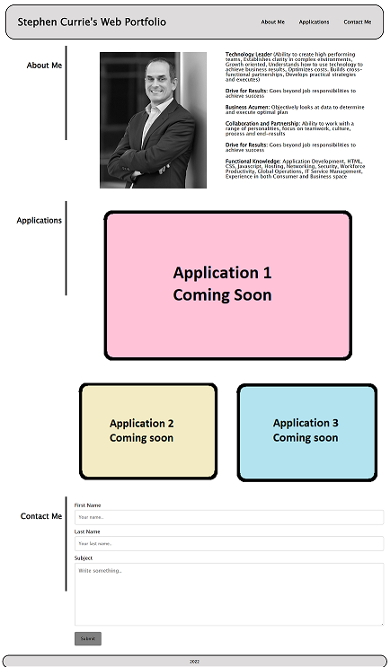

# Portfolio

## Description

The purpose of this web site is to create a portolio page that prospective employers can view.

The page showcases various attributes such as:
- Responsive design (including both media queries and flex)
- Links to applications
- Contact Me form

Although the page is live and meets the success criteria, there are still things to improve:

- Need better command of flex to guide where pages wrap
- Need better command of how to combine elements in rows and columns to create the proper layout

## Table of Contents

- [Screenshots and Links](#screenshots)
- [Acceptance Criteria](#acceptance)
- [What I Learned](#learned)

## ScreenShots
Below is a screen shot of the page

The page is live on  [GitHub Pages](https://stephencurrie.github.io/hw-2-portfolio/)

The code is in the  [GitHub Repository](https://github.com/stephencurrie/hw-2-portfolio)

## Acceptance

The following were the acceptance criteria for the ticket:

- [x] When I load the page, I am presented with the developer's name, a recent photo or avatar, and links to sections about them, their work, and how to contact them
- [x] When I click on a navigation link, the UI scrolls to the corresponding section
- [x] When I click on the Applications link, then the UI scrolls to a section with titled images of my applications (note, these are placeholder images)
- [x] The first application's image is larger in size than the others
- [x] The images link to live applications (note they currenly link to place holder pages)
- [x] The page is able to be viewed on different screen sizes and devices
- [x] The page is responsive and adapts to the viewport

## Learned

The following is a list of things I learned:
- How to combine elements to create different layouts
- How to use CSS to style a page from scratch
- How to use flex
- How to use media queries